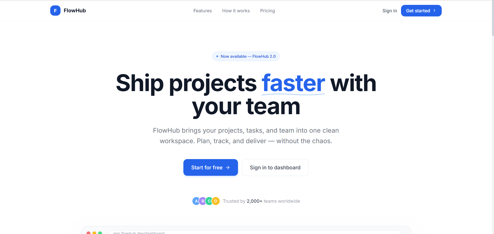
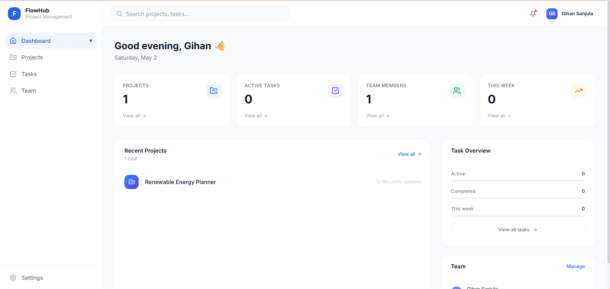
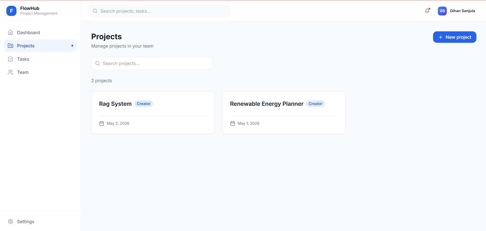
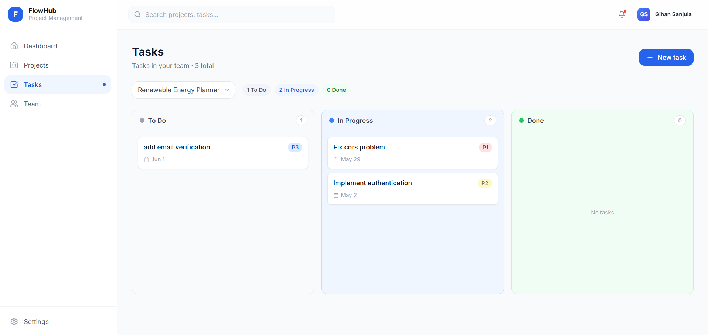

<div align="center">


**A full-stack, multi-tenant project management platform built with NestJS, Next.js, and PostgreSQL — deployed on WSO2 Choreo.**

[](https://www.typescriptlang.org/)
[](https://nestjs.com/)
[](https://nextjs.org/)
[](https://www.postgresql.org/)
[](https://www.docker.com/)
[](https://choreo.dev/)
[](./LICENSE)

[Live Demo](https://828b81a9-84ee-447b-aa10-7d1c2a827043.e1-us-east-azure.choreoapps.dev/) · [Backend API](https://your-api.choreoapis.dev) · [Blog Post](https://medium.com/@sanjulagihan94/wso2-choreo-tutorial-f84ebbe17dbd)

</div>

---

## What is FlowHub?

FlowHub is a project management platform where teams organize work around projects and tasks. Users sign up, receive a personal team automatically, and can manage projects, assign tasks, and collaborate with teammates.

The platform enforces **dual-layer access control**:
- **Platform roles** — `ADMIN` (full access) and `USER` (scoped access) assigned at the system level
- **Team roles** — `OWNER` and `MEMBER` assigned per team, stored in the `team_members` join table

Admin assignment follows a two-tier priority: if `INITIAL_ADMIN_EMAIL` is set in the environment, that account is always created as `ADMIN` on startup via `BootstrapService`. Otherwise, the first user to register is assigned `ADMIN` — determined inside a database transaction with `LOCK TABLE users IN SHARE ROW EXCLUSIVE MODE` to prevent race conditions.

---

## Architecture


---

## Tech Stack

| Layer | Technology |
|---|---|
| **Backend** | NestJS 11, TypeScript, TypeORM, Passport JWT |
| **Frontend** | Next.js 16 (App Router), React 19, Tailwind CSS |
| **Database** | PostgreSQL 15 (Choreo Managed) |
| **Auth** | JWT via HTTP-only cookies, bcrypt, refresh token rotation |
| **Deployment** | WSO2 Choreo (Docker multi-stage builds) |
| **Testing** | Jest, Supertest (unit + integration + E2E) |

---

## Features

- **Authentication** — JWT access tokens (15 min) + refresh tokens (7 days) via HTTP-only cookies; bcrypt password hashing
- **RBAC** — Platform-level roles (ADMIN/USER) and team-level roles (OWNER/MEMBER)
- **Projects** — Full CRUD; scoped to team membership
- **Tasks** — Status machine (To Do → In Progress → Done); optimistic locking via `@VersionColumn`
- **Teams** — Auto-created on signup; token-based invite system
- **Audit Logging** — Immutable audit trail across all write operations
- **Soft Deletes** — All entities use `deletedAt` for non-destructive removal
- **Global Infrastructure** — Winston logging, request metrics, pluggable alert service via `CommonModule`

---

## Project Structure

```
FlowHub/
├── backend/
│   ├── src/
│   │   ├── auth/            # JWT strategy, guards, login/signup/refresh
│   │   ├── users/           # User CRUD and profile management
│   │   ├── teams/           # Team management and memberships
│   │   ├── projects/        # Project CRUD
│   │   ├── tasks/           # Task CRUD with status machine
│   │   ├── invitations/     # Token-based team invite flow
│   │   ├── audit/           # Audit log writes
│   │   └── common/          # LoggerService, MetricsService, AlertService
│   ├── test/
│   │   └── integration/     # Integration test fixtures and helpers
│   └── .choreo/
│       └── component.yaml   # Choreo endpoint configuration
├── frontend/
│   ├── app/                 # Next.js App Router pages
│   │   ├── dashboard/
│   │   ├── projects/
│   │   ├── tasks/
│   │   ├── team/
│   │   ├── settings/
│   │   ├── login/
│   │   └── signup/
│   ├── components/
│   │   └── layout/          # Sidebar, Header, MainLayout
│   ├── lib/
│   │   ├── api.ts           # All domain API calls
│   │   └── auth.ts          # fetchWithAuth, logout, token refresh
│   └── .choreo/
│       └── component.yaml   # Choreo endpoint configuration
└── docker-compose.yml       # Local PostgreSQL only
```

---

## Getting Started (Local Development)

### Prerequisites

- Node.js 20+
- Docker Desktop

### 1. Clone the repo

```bash
git clone https://github.com/sanjula77/FlowHub.git
cd FlowHub
```

### 2. Start the database

```bash
docker compose up -d
```

Starts PostgreSQL on port `5435` (intentional — avoids conflict with any local PostgreSQL on `5432`).

### 3. Configure the backend

Create `backend/.env`:

```env
DB_HOST=localhost
DB_PORT=5435
DB_USER=flowhub
DB_PASSWORD=flowhub
DB_NAME=flowhub_db
JWT_SECRET=your-secret-key
FRONTEND_URL=http://localhost:3000

# Optional: auto-creates an admin account on first startup
INITIAL_ADMIN_EMAIL=admin@example.com
INITIAL_ADMIN_PASSWORD=secret
```

### 4. Start the backend

```bash
cd backend
npm install
npm run start:dev
```

Runs on `http://localhost:3001` with hot reload.

### 5. Start the frontend

```bash
cd frontend
npm install
npm run dev
```

Runs on `http://localhost:3000`.

---

## Deployment on WSO2 Choreo

FlowHub is deployed on [WSO2 Choreo](https://choreo.dev/) using Docker-based components.

### How it's set up

| Component | Type | URL pattern |
|---|---|---|
| Frontend | Web Application (Dockerfile) | `*.choreoapps.dev` |
| Backend | REST API (Dockerfile) | `*.choreoapis.dev` |
| Database | Choreo Managed PostgreSQL | Resources → Databases |

### Key deployment notes

**Cross-domain cookies** — The frontend (`choreoapps.dev`) and backend (`choreoapis.dev`) run on different domains. Cookies must use `sameSite: 'none'` and `secure: true` to be sent in cross-domain requests:

```typescript
res.cookie('accessToken', token, {
  httpOnly: true,
  secure: true,
  sameSite: 'none',
  maxAge: 15 * 60 * 1000,
});
```

**OAuth2 Gateway** — Choreo's built-in OAuth2 gateway must be disabled for public auth endpoints. In the Choreo console: **Deploy → Configure & Deploy → Step 3/3: Endpoint Details** → uncheck the OAuth2 Security Scheme for `/auth/login`, `/auth/signup`, and `/auth/refresh-token`.

**Frontend build argument** — `NEXT_PUBLIC_API_URL` must be injected as a Docker `ARG` at build time (not a runtime env var):

```dockerfile
ARG NEXT_PUBLIC_API_URL
ENV NEXT_PUBLIC_API_URL=$NEXT_PUBLIC_API_URL
```

---

## Environment Variables

### Backend (`backend/.env`)

| Variable | Required | Description |
|---|---|---|
| `DB_HOST` | ✅ | PostgreSQL host |
| `DB_PORT` | ✅ | PostgreSQL port (5435 locally) |
| `DB_USER` | ✅ | PostgreSQL username |
| `DB_PASSWORD` | ✅ | PostgreSQL password |
| `DB_NAME` | ✅ | Database name |
| `JWT_SECRET` | ✅ | Secret for signing JWT tokens |
| `FRONTEND_URL` | ✅ | Frontend origin for CORS |
| `NODE_ENV` | ✅ | `production` enables SSL and disables `synchronize` |
| `INITIAL_ADMIN_EMAIL` | ⬜ | Auto-creates admin on startup |
| `INITIAL_ADMIN_PASSWORD` | ⬜ | Required if `INITIAL_ADMIN_EMAIL` is set |

### Frontend (`frontend/.env.local`)

| Variable | Required | Description |
|---|---|---|
| `NEXT_PUBLIC_API_URL` | ✅ | Backend API URL (e.g., `http://localhost:3001`) |

---

## API Overview

| Method | Endpoint | Description |
|---|---|---|
| `POST` | `/auth/signup` | Register a new user |
| `POST` | `/auth/login` | Login and receive JWT cookies |
| `POST` | `/auth/refresh-token` | Rotate access token using refresh token |
| `POST` | `/auth/logout` | Clear auth cookies |
| `GET` | `/users/me` | Get current user profile |
| `PATCH` | `/users/me` | Update current user profile |
| `GET` | `/projects` | List projects for the current team |
| `POST` | `/projects` | Create a new project |
| `GET` | `/tasks` | List tasks (filterable by project/status) |
| `POST` | `/tasks` | Create a new task |
| `PATCH` | `/tasks/:id` | Update task status or details |
| `GET` | `/teams/me` | Get current user's team |
| `POST` | `/invitations` | Send a team invite |

---

## Testing

```bash
cd backend

npm run test              # Unit tests
npm run test:integration  # Integration tests (requires live PostgreSQL at flowhub_test_db)
npm run test:e2e          # End-to-end tests
npm run test:cov          # Coverage report
```

Run a single test file:

```bash
npx jest src/auth/auth.service.spec.ts
npx jest --testPathPattern=auth
```

Integration tests use a separate database (`flowhub_test_db`) with the same credentials. Tests run sequentially (`maxWorkers: 1`) with a 30-second timeout.

---

## Screenshots

| Landing | Dashboard |
|---|---|
|  |  |

| Projects | Tasks |
|---|---|
|  |  |

---

## Blog Post

Read the full deployment walkthrough: **[Deploying FlowHub on WSO2 Choreo — NestJS + Next.js Tutorial](https://medium.com/@sanjulagihan94/wso2-choreo-tutorial-f84ebbe17dbd)**

Covers Docker multi-stage builds, cross-domain cookie authentication, OAuth2 gateway configuration, and the Choreo managed database setup.

---

## License

UNLICENSED — all rights reserved.
